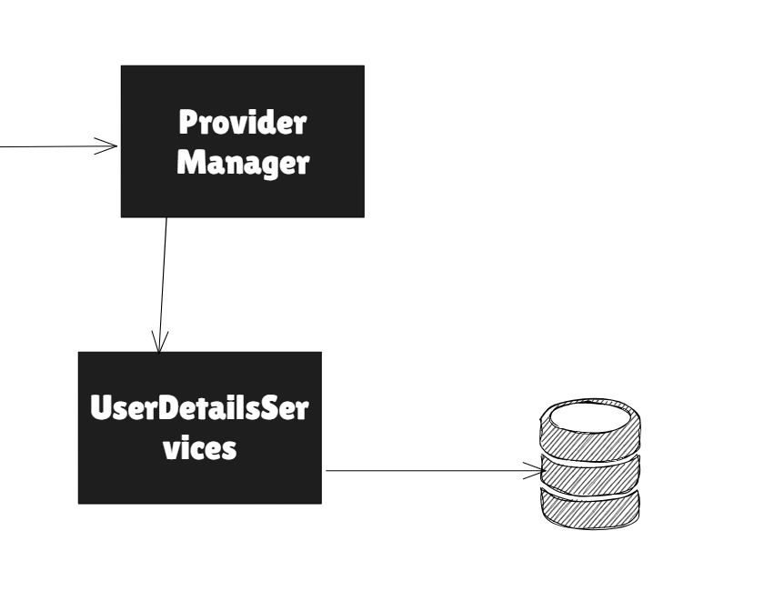
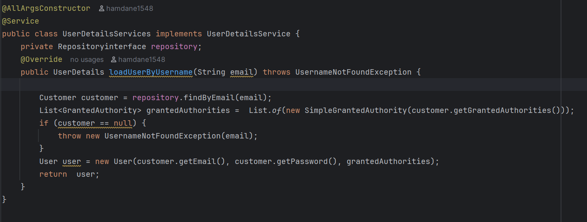

Create Custom UerDetailsServices from DB

ici avons implement le UserDetailsServices
par defualt le DAOauthentificationprovider utilise le UserDetails  pour charge le user from une
source alors le code pour implement cette custom configuration 
